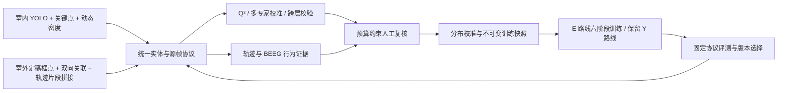

# label_data_flywheel

**室内红外与室外 RGB 蜜蜂标注的数据飞轮。** 保留经过筛选的检测、姿态、密度与追踪方案，整合质量校准、统计采样、行为证据、人工复核和训练数据回流。

**范围只限数据飞轮模块。** 赛事文件中的标注格式、划分、复核、来源和抽帧复现要求在此落实；四 EXE、ONNX、Windows 离线打包及完整参赛材料由其他模块负责，不作为飞轮完成标准。见 [范围与数据规范](docs/数据飞轮范围与数据规范.md)。

原始标注、算法预测、人工确认结果分别保存。每轮生成新快照；没有相同评测协议下的改进证据，就不替换已有最优版本。



## 入口

| 需要做什么 | 入口 |
|---|---|
| 运行标注整理与复核候选生成 | `bee-flywheel round --config ... --output ...` |
| 数量、热图、近邻网络与纯视频变化复核 | `bee-flywheel colony --config configs/colony.example.json --output 新目录` |
| 导出、校验内部 COCO 交换包 | `bee-flywheel export-annotations` / `validate-annotations` |
| 转换为 YOLO，保留原标注与 ID | `bee-flywheel export-yolo` / `validate-yolo` |
| 整理检测、姿态和 MOT 三个交付目录 | `bee-flywheel export-delivery --config configs/delivery.example.json --output 05_数据标注成果` |
| 当前最优室内全量 ID 方案 | [legacy/indoor/run_appearance20.py](legacy/indoor/run_appearance20.py) |
| 当前室外 ID-only 最终方案 | [run_final.py](legacy/outdoor/final_id_only/run_final.py) |
| 室外 SAM2.1 对照路线 | [sam2_bee_tracker.py](legacy/outdoor/sam2_bee_tracker.py) |
| 关键点、YOLO、密度推理 | [tools/infer_models.py](tools/infer_models.py) |
| 双域六阶段联合训练 | [E 路线](legacy/route_e/ecdetseg/configs/bee_e/e_route_continuous_1280.yml) |
| 快照绑定到 E 训练器并执行 | [tools/prepare_e_round.py](tools/prepare_e_round.py)，`--execute` 启动训练 |
| 同协议最优模型比选 | `bee-flywheel select-champion` |
| 旧 Y 路线及全部自定义模型 | [legacy/route_y](legacy/route_y) |
| ViTPose / CountAnything / CountGD++ 历史实验 | [legacy/server_experiments](legacy/server_experiments) |
| 文档功能对应实现 | [docs/功能与验证.md](docs/功能与验证.md) |
| 最新学术方法正文（含团队软件截图及室内结果） | [Hive-Q²K Dual 方法](docs/Hive_Q2K_Dual_方法.md) |
| 室内实验配图版的保留入口（与最新版正文同步） | [室内实验配图版](docs/Hive_Q2K_Dual_方法_室内实验配图.md) |
| 正式数据标注说明（队伍 595335） | [数据标注说明-595335.docx](src/label_data_flywheel/assets/数据标注说明-595335.docx) |
| 群体行为与蜂学一手文献、实测及使用 | [docs/群体行为与蜂学研究.md](docs/群体行为与蜂学研究.md) |

## 安装和使用

完整仓库在 Linux 服务器上运行。大模型保持原有独立 Python 环境；无需把训练数据、权重或视频下载到工作电脑。

```bash
git clone https://github.com/CyberMagician01/label_data_flywheel.git
cd label_data_flywheel
python -m pip install -e '.[vision,test]'
bee-flywheel --help
```

配置 [configs/round.example.json](configs/round.example.json) 中的输入路径和真实 split，然后运行：

```bash
bee-flywheel round --config configs/round.example.json --output /data/bee26/flywheel_rounds/round_001
```

默认输出统一标注、分层质量、ErrorCube、行为观测与复核队列。`review_decisions` 接入人工决定后先修正真实观测，再重建受影响视频的插值。`quality_references` 可提供人工参考，用于位置、头尾和身份误差；未提供时使用标明来源的一致性证据。Q² 写回训练快照，由 E 训练器实际加权。`previous_round_policy` 读取上一轮的采样目标、知识图和提示记忆；没有手填目标时，按应用覆盖、评价覆盖与训练误差生成目标分布。

`export_review_tasks=true` 输出团队工具可读取的 LabelMe 任务；编辑 `review_tasks/editable` 后，用 `bee-flywheel import-review-tasks --input 任务目录 --output decisions.json` 回传。未改动且未标记确认的对象不自动变成人工监督。个体行为和群体判读分别导出到 `training_snapshot/behavior`，对应 `train-behavior` 与 `train-colony-behavior` 两个入口。`candidate_evidence`、`expert_calibration` 接入多专家结果；`pose_sources` 按同帧匹配附着已有头尾点。

在 E 的模型环境中运行 `python tools/prepare_e_round.py --snapshot 快照目录 --base-config 原训练配置.yml --output 新轮次/train.yml --execute`，即可在数据与划分校验后启动训练；接续权重时增加 `--checkpoint 权重路径 --resume`。训练后的预测用 `evaluate` 按固定 calibration 协议评估，将同协议结果登记为模型记录，再用 `select-champion --champion 原模型.json --candidate 新模型.json --directions 指标方向.json --output 新登记目录` 比选。`directions` 例如 `{"IDF1":"max","MOTA":"max"}`；模型记录字段见 `registry.choose_champion`。测试集不参与跨轮比选，后续预测仍由原模型推理入口产生并送入下一轮。

### YOLO 标注副本

```bash
python -m pip install -e '.[annotations]'
bee-flywheel export-yolo --config configs/yolo.example.json --output /data/bee26/yolo_new_version
bee-flywheel validate-yolo --input /data/bee26/yolo_new_version
```

每张源图对应一个 TXT。`detect/labels` 每行是 `class cx cy w h`；`pose/labels` 再接头、腹尾两个点的 `x y v`，共 11 列。坐标按源图宽高归一化；`v` 是 0/1/2 可见性编码，原始关键点置信度另存。检测与姿态标签独立，不把 ID 追加进标准 YOLO 行。

`frame_ids.jsonl.gz` 每行对应一个源帧，其中 `label_files` 指向 TXT，`rows` 中的 `line` 从 1 开始，与 TXT 行号一一对应，保留 `track_id`、来源 ID、置信度和插值来源。ID 沿用原版，并以视频、标注组为作用域。`audit_hidden` 保存隐藏框的 YOLO 副本，不放入训练 labels。原始文件只读，已存在的输出目录拒绝覆盖。人工与机器标签分别在 `confirmed`、`candidates` 中；室外已有 `bee_shadow` 类独立保留。

输出只包含标注。使用图像时，将原图放到对应的 `detect/images` 或 `pose/images` 下，与 `labels` 保持相同相对目录和文件名。`label_schema.yaml` 描述类别和关键点；已有划分写入 `splits`。未划分全集保留 `unassigned`，不会自动变成训练集；仅有检测框而没有任何关键点的帧，不列入姿态训练清单。

### 交付目录

`export-delivery` 整理 `annotations/<视频>/`（YOLO 五列检测）、`annotations_pose/<视频>/`（YOLO 两点姿态）和 `annotations_tracking/<视频>/tracks.txt`（MOT 十列）。MOT 帧号、左上角坐标从 1 起算。影子保留独立检测类别，两点可见性为零，不参与轨迹、蜂体训练和群体数量统计；原始点与 ID 保留在附加信息中。

提交目录另外只放 `splits/train.txt`、`splits/val.txt`、`extract_frames.py` 和 `数据标注说明-595335.docx`。按已确定的提交安排，划分占位文件保持为空。帧索引、逐行来源映射、隐藏候选、seqinfo、原人工划分和未分配帧列表保存到并列的 `05_数据标注成果_附加信息/`。配套图像放在标注包外。历史全量检查见 [转换证据](evidence/yolo_conversion_verified.json) 和 [交付检查](evidence/delivery_verified.json)；历史归档结构保留，以新版导出入口和正式 Word 为当前提交规范。

历史 YOLO 副本发布到私有 ModelScope 的 `versions/v5_yolo_format_20260908/`。其中 `annotations/` 保留室内、室外、原室外姿态及人工标注的独立归档；`delivery/05_数据标注成果.tar.gz` 是当时的全量八视频交付包，其附加信息布局以该历史版本为准。原 v2/v4 标注与已冻结 benchmark 保持原样，GitHub 另存 [benchmark YOLO 副本](legacy/indoor/benchmark_yolo)。

```bash
# 先验证具体模型命令；去掉 --dry-run 即实际执行。
bee-flywheel backend density --config configs/backends.3090.json --dry-run -- \
  --checkpoint /data/bee26/vitpose_bee_full_20260825/work_dirs/density_scene_B/best_mae.pth \
  --image /data/bee26/example.jpg --output /data/bee26/density.json

# 跟踪指标使用官方 TrackEval；此命令只比较人工标注源帧。
python -m pip install -e '.[evaluation]'
bee-flywheel evaluate --gt /data/bee26/gt.jsonl --input /data/bee26/pred.jsonl \
  --video B-5-3 --domain IR_in --group 03 --tracking --output /data/bee26/metrics.json
```

服务器配置文件是既有环境的路径模板；运行前应使用自己的 checkpoint 和数据路径。原训练配置含冻结数据哈希，不能通过修改哈希来绕过数据划分检查；新一轮应重新生成并验证快照契约。

## 保留的室内默认方案

- 9 月 6 日检测、动态密度、关键点与几何修正结果作为观测输入。
- 蜜蜂外观嵌入、动量、位移与姿态约束完成整段关联；ID 不按分块重置。
- 内部记忆 150 帧、边缘 75 帧；不足 30 次观测的短轨迹过滤。
- 同 ID 两端间隔不超过 90 个源帧时线性补框。
- 交集达到较小框面积的 20%，且交集至少 16 像素时，只隐藏冲突插值框；保留观测框和隐藏记录。

这是实际选定配置，不把早期讨论过的每个参数都混入最终版本。30 FPS 下 90 帧对应 3 秒。

旧发布保留在私有 [ModelScope 数据集 poloso/yolo_indoor](https://modelscope.cn/datasets/poloso/yolo_indoor)，当前室内选择指向 `versions/v4_indoor_appearance_iomin20_20260908/`。GitHub 保存代码、已有 benchmark 和验证摘要；完整预测、视频帧、权重仍留在原服务器与私有数据集。

## 方法与输入范围

方法包含双域联合训练、Q²/Q-MoE、目标分布采样、B-TCA、主动复核与知识更新。方法正文介绍各模块的作用、机制和相互关系，功能对应表提供代码入口，实验部分呈现具体对照及其评价协议。

默认群体复核使用视频中的数量、密度、运动和近邻证据。温度、天气、施药、称重等外部条件未提供，因此不纳入当前方法的环境推断。行为入口已经排除插值和已拒绝实例对实际观测量的贡献；双域 32 帧及 A-5-1 的 5,400 帧验证见 [视频分析验证](evidence/video_only_revision.json)。

## 实际验证

验证结果集中在 [evidence](evidence)。已执行：真实 RGB/IR 关键点与密度推理、Y 路线 checkpoint 推理、3090 上 E 网络双域前向/反向及优化器更新、4090 上室外 A-5-1 连续 16 帧原版 SAM 推理、32 帧双域飞轮处理，以及真实 348 个标注框的 E schema 数据加载。

历史核心模块 34 项、E 路线 153 项测试结果见 [verification_summary.json](evidence/verification_summary.json)；保留版本见 [model_registry.json](configs/model_registry.json)。数据标准化另用 34 个真实源帧验证，见 [annotation_standardization_verified.json](evidence/annotation_standardization_verified.json)。

本次代码与两份说明的对齐检查见 [alignment_validation.json](evidence/alignment_validation.json)。新增回归覆盖 Q² 到真实训练梯度、不完全标注的背景屏蔽、人工复核后重建插值、跨轮知识与提示记忆、行为监督粒度、影子类别，以及室外六帧输入的完整 ID-only 流程。这里的六帧是接口回归输入，不计作新的室外精度实验。

上述记录分别对应模型推理、网络前反向、标注加载和接口回归；室内检测与跟踪的对照结果见方法正文第 4.7 节。各项记录按数据来源、输入条件和评价协议归档，具体模型由版本登记关联。行为输出经人工确认后进入相应粒度的监督学习。

原始方案保存在 [docs/source_proposal.md](docs/source_proposal.md)。来源、版本与许可见 [THIRD_PARTY.md](THIRD_PARTY.md)。
