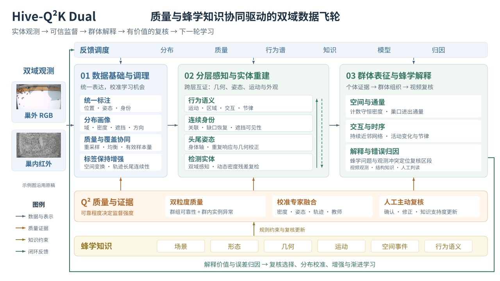
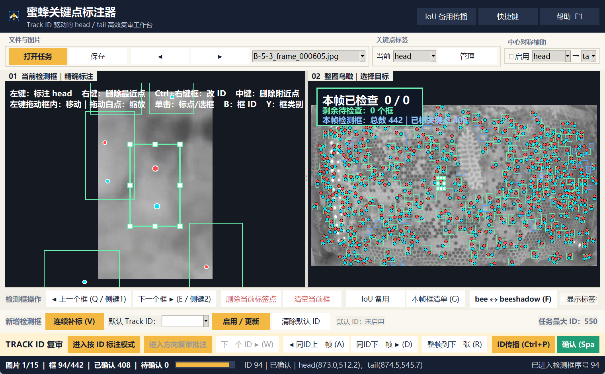
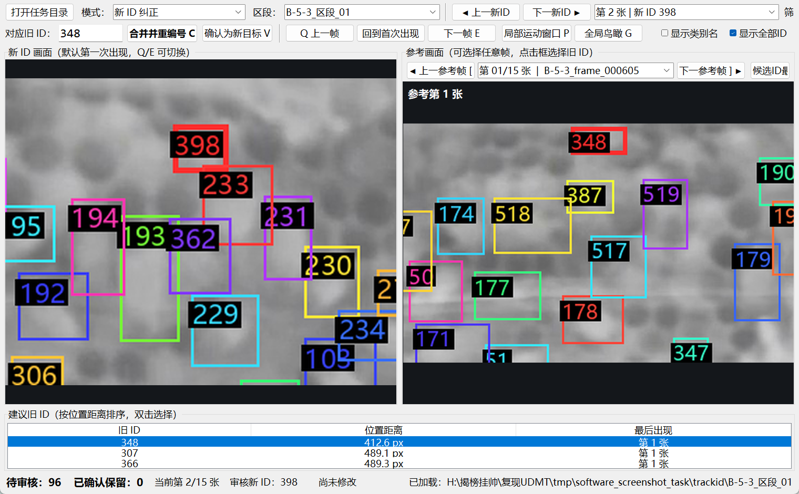
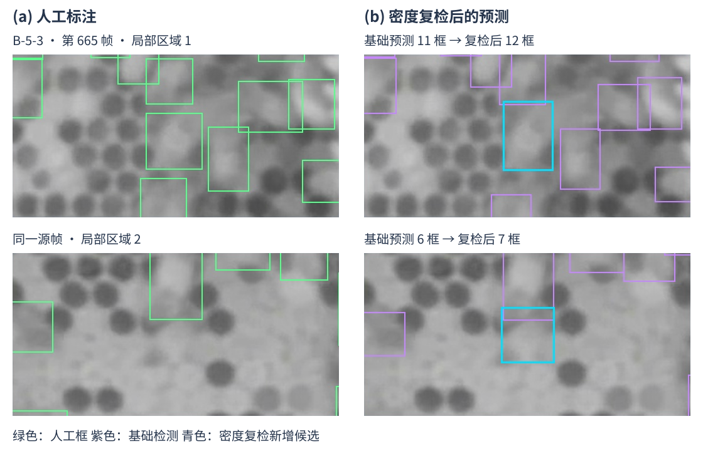

# Hive-Q²K Dual：质量与蜂学知识协同驱动的双域数据飞轮

## 摘要

理解蜂群如何组织个体活动，需要将位置、身体姿态和持续身份连接为可解释的群体观测。室内红外视频中的密集遮挡与室外可见光视频中的外观变化，使这种联系容易被漏检、重复响应和身份错配打断；当不完整观测进一步参与行为分析和模型再学习时，测量误差还会沿着“实体—行为—监督”的联系持续传播。本研究围绕一个核心问题展开：如何使不断积累的蜜蜂视觉数据，在扩大观测覆盖的同时，为后续学习提供可靠且具有蜂学意义的监督？

我们提出 Hive-Q²K Dual，其核心思想是：同一实体的证据可以跨时间积累，而这些证据对不同任务的贡献，应由相应的可观测性与可靠程度共同决定。方法首先通过双域感知、密度残差、身体结构与时序关联形成时空实体，再以群组与实例两个粒度的质量估计及校准专家证据调节监督强度。在此基础上，可用实体被组织为空间密度、巢口通量、持续近邻网络与群体时序，并依据姿态、运动和空间关系形成具体的蜂学复核问题。跨层矛盾和解释价值进一步引导主动复核、分布校准、轨迹增强与渐进学习，使一次修正同时作用于当前标注、下一轮学习经验及知识支持度。由此，方法将视觉观测与蜂学解释连接为相互校正的数据飞轮。

## 1. 研究动机与核心洞察

### 1.1 从连续个体观测到可靠的群体理解

蜂群活动通过大量个体之间的局部联系形成。对这种组织过程的研究，既需要知道某一时刻有多少蜜蜂，也需要知道哪些个体在持续移动、靠近或穿过巢口。蜂群无标记追踪与长期机器人观测分别展示了个体分辨和多尺度行为测量的价值，[1](https://www.nature.com/articles/s41467-021-21769-1)、[2](https://www.science.org/doi/10.1126/scirobotics.adn6848) 而多动物姿态追踪进一步将身体部位与时序身份联系起来。[3](https://www.nature.com/articles/s41592-022-01426-1) 这些进展使大规模行为观测成为可能，也使观测可靠性成为连接视觉模型与蜂学问题的关键。

这一联系在密集遮挡中尤其脆弱。同一只蜜蜂可能同时触发完整框与局部框，相邻蜜蜂也可能在短时间内共享相似的外观和身体轴。一次局部重复因而可能产生额外身份，一次错误连接则可能产生并不存在的大位移；当这些结果进入计数、速度或近邻网络时，视觉误差便具有了群体行为的表象。Keypoint-MoSeq 将姿态噪声与真实行为动态联系起来处理，Lightning Pose 则利用时序与结构约束发现逐帧置信度难以充分反映的姿态错误。[4](https://www.nature.com/articles/s41592-024-02318-2)、[5](https://www.nature.com/articles/s41592-024-02319-1) 它们共同提示，行为分析的可靠性取决于观测误差如何被表达和传播。

数据飞轮使这一测量问题进一步延伸到学习过程。自动生成的标注既是当前模型的输出，又会成为后续模型的监督来源；如果某类遮挡持续产生局部框，这种偏差便可能在相似场景中反复获得学习机会。与此同时，困难场景常常具有较低的即时置信度，一味减少其参与又会削弱下一轮对遮挡和稀缺姿态的覆盖。因此，飞轮需要同时回答两个相互依赖的问题：当前证据能够支持什么监督，以及这些监督应当在后续学习中获得多少关注。

**我们的核心洞察是：证据可以沿同一实体跨时间积累，但它对位置、身份与行为等不同任务的贡献，应由各自的可观测性和可靠程度共同决定。** 例如，遮挡前后的观测可以充分支持同一身份的联系，遮挡期间却可能缺少独立可见的身体区域；该实体仍能维持轨迹连接，而当前帧中的密度和近邻统计应根据实际可用的观测形成。由此，身份连续性、空间可见性和监督可信度获得了各自明确的作用。

这一洞察也赋予跨层矛盾新的价值。当局部计数升高、身份突然增多而真实活动变化有限时，相互不协调的证据可以帮助定位值得复核的区段；当实体观测一致且群体结构呈现持续变化时，同一区段又可以进入蜂学解释。复核的对象因此从单个低分预测扩展到具有下游影响的实体关系与行为时段。我们据此研究：**如何以时空实体维持证据联系，以质量估计决定监督强度，再以群体解释确定下一轮的数据获取方向。**

### 1.2 相关研究与方法定位

动物行为测量首先提供了跨层组织的研究基础。蜂群无标记追踪将检测、身体方向和个体表征用于身份恢复，长期机器人观测则依据生物学问题协调观察尺度与持续时间。[1](https://www.nature.com/articles/s41467-021-21769-1)、[2](https://www.science.org/doi/10.1126/scirobotics.adn6848) SLEAP、Keypoint-MoSeq 和 Lightning Pose 进一步从部位归属、姿态动态与结构误差三个角度连接视觉估计和行为理解。[3](https://www.nature.com/articles/s41592-022-01426-1)、[4](https://www.nature.com/articles/s41592-024-02318-2)、[5](https://www.nature.com/articles/s41592-024-02319-1) 与这些研究相衔接，我们关注跨层观测进入监督后的持续作用：哪些证据应被学习，哪些矛盾值得再次获取人工判断。

异构监督的利用进一步影响这种持续学习。SuperAnimal 将多来源关键点数据组织到共享姿态表达中，并利用监督掩码处理不同数据集的标注差异。[6](https://www.nature.com/articles/s41467-024-48792-2) 半监督检测中的 Unbiased Teacher 和 Soft Teacher 分别研究伪标签偏差与可靠性加权，说明伪监督的组成和利用强度都会影响学习。[7](https://openreview.net/forum?id=MJIve1zgR_)、[8](https://openaccess.thecvf.com/content/ICCV2021/html/Xu_End-to-End_Semi-Supervised_Object_Detection_With_Soft_Teacher_ICCV_2021_paper.html) 我们将这些问题落实到蜜蜂的双域、多层监督：群组统计描述来源偏差，实例质量描述局部异常，分布校准则调节不同场景中的学习机会。

主动学习使监督来源能够随模型演进。Active Teacher 以困难程度、信息量和多样性选择新增标注，并将选择与教师学习联系起来。[9](https://openaccess.thecvf.com/content/CVPR2022/html/Mi_Active_Teacher_for_Semi-Supervised_Object_Detection_CVPR_2022_paper.html) 在蜂群场景中，一个样本的修正价值还取决于其下游联系：一次身份修正可能同时改变运动量和交互判断，一个群体时间窗的复核也可能反向定位上游观测错误。我们因此将跨层修正与蜂学解释价值纳入数据选择，并使复核结果同时更新监督和知识支持度。

时序视觉研究则为实体联系提供基础。Object Permanence 明确研究了不可见目标的持续追踪，SAM 2 利用时序记忆实现视频对象传播，CoTracker3 展示了点轨迹与真实视频伪监督之间的联系。[10](https://openaccess.thecvf.com/content/ICCV2021/html/Tokmakov_Learning_To_Track_With_Object_Permanence_ICCV_2021_paper.html)、[11](https://proceedings.iclr.cc/paper_files/paper/2025/hash/45c1f6a8cbf2da59ebf2c802b4f742cd-Abstract-Conference.html)、[12](https://openaccess.thecvf.com/content/ICCV2025/html/Karaev_CoTracker3_Simpler_and_Better_Point_Tracking_by_Pseudo-Labelling_Real_Videos_ICCV_2025_paper.html) 我们以这些时序能力为研究背景，将个体联系进一步延伸到任务可观测性、监督质量和行为复核之间的协调。方法的研究重点由此落在证据如何形成、如何被使用，以及如何返回下一轮学习这三个连续环节。

## 2. 总体方法：从时空实体到知识反馈

设观测域为 $d\in\{\mathrm{IR},\mathrm{RGB}\}$，分别对应室内红外与室外可见光视频。对任一个体 $i$，我们将其时刻 $t$ 的空间范围记为 $\mathbf b_i(t)$，头尾姿态记为 $\mathbf k_i(t)$，时序身份记为 $\iota_i$。这些变量共同描述一个时空实体，而任务相关的可观测性 $m_{i\ell}$ 则指明该实体能够为监督层级 $\ell$ 提供哪些信息。

在第 $r$ 轮中，域内标注器与当前学习模型提供初始视觉证据，时空重建将其组织为实体集合；质量推断随后为不同层级的监督赋权，行为建模则依据可观测条件将实体关系提升为群体表征。两类结果共同提出复核候选，人工判断进一步修正标签并更新知识支持度。误差归因据此确定下一轮需要增加覆盖的场景，分布校准与增强形成相应的学习经验，联合训练再将这些经验转化为模型参数 $\theta_{r+1}$。图 1 展示了这一过程中的正向证据链与反馈关系。

*图 1. Hive-Q²K Dual 的双域数据飞轮。上层由数据调理、分层感知与群体解释构成正向证据链；Q² 质量层调节监督强度，蜂学知识层提供场景、身体结构、运动与行为解释的约束。右侧的解释与误差归因经外环返回复核选择、分布校准和渐进学习。中部的双向联系表示实体层级之间的抽象与校验。本图依据 BEE 流程图改绘，保留原有双域观测示例与各功能之间的联系。*

这里的联系具有明确的方向：时空实体为质量判断提供上下文，可观测性决定相应实体能够支持哪些行为测量，行为知识为复核指出具有解释价值的时段。反馈因而作用于三个对象：标签修正改变“学什么”，分布与增强改变“重点看到什么”，知识更新改变“下一轮重点检查什么”。以下先说明实体证据的形成，再按错误类型展开闭环处理，并依次展示室内定性与定量对照；在此基础上，进一步说明群体解释与人工复核如何返回学习。

## 3. 跨层证据约束的时空实体重建

### 3.1 双域证据获取与共享形态学习

室内与室外共享蜜蜂的身体结构，却具有不同的成像统计与运动特征。室内红外观测强调灰度轮廓、密集遮挡与较缓慢的局部运动；室外可见光观测则包含颜色、光照变化和更加显著的个体进出。因此，证据获取需要适应各域的观测条件，而后续学习需要将这些证据归结为共同的身体与实体表达。我们据此区分域内标注器和跨域学习模型，并通过统一的位置、姿态及身份关系连接两者。

域内标注器负责形成可供复核和学习的视觉观测。室内由 YOLO 获取检测候选，关键点模型提供头尾姿态，外观、位移与身体轴共同支持个体关联。室外则在已校正的检测与姿态上，以相互重叠的时间窗积累正向、反向关联证据，结合光流、外观与身体方向选择一致连接，再通过运动约束拼接轨迹片段。身份更新沿用原有身体观测，使检测几何与头尾姿态保留明确的实体归属。SAM 2 框架的 SAM2.1 时序传播与检测吸附构成另一条对照路线，[11](https://proceedings.iclr.cc/paper_files/paper/2025/hash/45c1f6a8cbf2da59ebf2c802b4f742cd-Abstract-Conference.html) 用于比较分割传播和观测关联两种恢复连续性的方式。密度与时序证据随后围绕这些实体补充和检验观测。

跨域学习模型从质量加权的实体监督中学习共享形态。共享视觉编码器及前景原型表达两域共同的蜜蜂身体结构，低层多尺度特征中的低秩域适配与双域归一化吸收成像差异，姿态与密度分支进一步学习身体关系和局部群体分布。域内标注器由此提供异构监督，跨域学习模型通过第 7 节的联合目标吸收这些监督；模型更新后的预测再次进入实体重建，成为下一轮可以比较和修正的视觉证据。

### 3.2 密度残差引导的局部观测补充

全图检测提供离散实体，密度估计则表达局部区域中的目标总量。两者的互补性在于：当密集区域中的个体未被充分分离时，密度分支仍可能保留群体数量的响应。因此，我们将已有检测转化为计数守恒的密度表示，并利用两种表示之间的正残差定位值得进一步观察的区域：

$$
\begin{aligned}
D_t^{\mathrm{obs}}(u)
&=\sum_{i\in\mathcal O_t}\overline K_\sigma(u;\mathbf c_i(t)),\\
R_t(u)
&=\bigl[\widehat D_t(u)-D_t^{\mathrm{obs}}(u)\bigr]_+,\\
W_t^\star
&=\underset{W\in\mathcal W}{\arg\max}\;
\sum_{u\in W}R_t(u).
\end{aligned}
$$

其中，$\mathcal O_t$ 为当前检测集合，$\mathbf c_i(t)$ 为框中心，$\widehat D_t$ 为预测密度，$[a]_+=\max(a,0)$；核函数 $\overline K_\sigma$ 在图像范围内归一化，使每个实体贡献一个单位的计数质量。候选窗口集合 $\mathcal W$ 采用相同视野尺度，因此 $W_t^\star$ 表示尚未被已有检测充分解释的高残差区域。

局部复检在该区域重新获取个体观测，并结合姿态与邻域关系判断新增响应。对于稳定背景中的局部变化，光流、点轨迹与帧间差分提供额外的时序支持；这些支持与外观、密度证据共同参与后续的可靠性判断。通过这种方式，补充观测的位置由当前场景的残差分布决定，补充观测的接受程度则由多种证据共同决定。

### 3.3 身体结构约束的观测校正

局部复检扩大了候选集合，也使同一个体的完整响应与局部响应可能同时出现。为此，我们先利用框的包含关系定位嵌套候选，再结合头尾位置、身体轴和邻近时刻的支持判断它们是否指向同一身体。对于交叠候选，保留优先级综合考虑身体覆盖程度与时序支持；对于相对独立且偏窄的框，则依据身体范围适度扩展其短边。进一步地，头尾点接近框边缘时，沿相应方向补充几何范围，使身体覆盖与姿态证据相互协调。

姿态自身的方向歧义也在这一过程中得到处理。我们分别考察原始头尾对应与交换后的对应，以框对角线归一化的端点距离衡量位置差异，并结合体轴角差和多帧证据判断方向一致性。这样，关键点既用于描述蜜蜂姿态，也用于区分相邻实体、识别局部重复响应和解释异常形变。

### 3.4 身份连续性与可见性分离

完成观测校正后，我们以外观相似性、运动连续性和弱姿态约束建立身份联系。ByteTrack 表明，低分响应仍可能通过已有轨迹获得有效支持；[16](https://link.springer.com/chapter/10.1007/978-3-031-20047-2_1) 这为结合历史上下文判断当前观测提供了直接依据。短时缺失的个体保留身份记忆，边缘区域则根据个体进出的空间先验采用较短记忆。对于前后已经关联到同一身份的观测，以两端位置约束缺口内的几何恢复：

$$
\begin{aligned}
\widetilde{\mathbf b}_i(t)
&=(1-\alpha_t)\mathbf b_i(t_a)
  +\alpha_t\mathbf b_i(t_b),\\
\alpha_t
&=\frac{t-t_a}{t_b-t_a},
\qquad
t_a<t<t_b,\quad t_b-t_a\leq\Delta_{\max}.
\end{aligned}
$$

上述插值建立在已确定的身份联系之上。OC-SORT 利用重新出现的观测修正遮挡期间累积的运动误差，[15](https://openaccess.thecvf.com/content/CVPR2023/html/Cao_Observation-Centric_SORT_Rethinking_SORT_for_Robust_Multi-Object_Tracking_CVPR_2023_paper.html) 本文据两端观测恢复缺口几何，并进一步判断恢复位置在当前帧中的可见性。室内方案在 30 帧每秒的观测下，对内部与边缘个体分别采用 5 秒和 2.5 秒的身份记忆，以累计至少 30 帧直接观测约束轨迹支持，并将插值两端的最大间隔设为 3 秒。由此，短时遮挡中的位置恢复与整段身份关联形成一致的时间尺度。

几何恢复之后，还需要判断该位置是否适合在当前帧中显式呈现。蜜蜂相互遮挡时，一条身份连续的轨迹可能暂时缺少独立的可见区域。因此，我们为插值框单独设置可见性约束，以交集占较小框面积的比例刻画冲突程度：

$$
\operatorname{IoMin}(\mathbf b_i,\mathbf b_j)
=\frac{|\mathbf b_i\cap\mathbf b_j|}
       {\min\!\left(|\mathbf b_i|,|\mathbf b_j|\right)}.
$$

当插值框与已保留框的 IoMin 达到 $0.20$，且交集面积达到 $16$ 像素平方时，暂时隐藏该插值框。直接观测优先于插值推断；多个插值候选之间，则依次依据较短的端点间隔、较长的观测支持和较小的端点位移确定保留顺序。隐藏状态仍维持原有身份联系，后续观测因而能够继续连接同一个体。这使遮挡处理同时兼顾身份连续性与当前帧的实体可分辨性。

## 4. 误差分型驱动的质量推断与闭环修正

时空实体将检测、姿态和身份连接起来，也使不同环节的错误能够沿同一个体被追溯。一次框体重复可能派生两个身份，身份错配又可能产生异常位移；如果这些结果继续用于训练或行为统计，局部错误便会成为后续模型和群体解释的共同偏差。因此，数据飞轮中的错误分析需要先辨明失效环节，再选择修正证据，最后检验修正如何改变观测与监督。

### 4.1 按失效环节建立错误分类

我们以观测形成和使用的先后关系为主轴，将问题分为覆盖、框体、姿态、身份和监督使用五类。它们分别回答“个体是否被发现”“身体是否被正确分离与覆盖”“头尾是否属于该个体且方向正确”“前后是否仍为同一个体”以及“这些证据是否被恰当地用于学习和解释”。表 1 将每类问题的表现、形成机制与传播影响联系起来。

*表 1. 蜜蜂标注与监督中的错误类型。分类依据是失效环节，同一片段可以具有多个错误标签。*

| 错误类型 | 具体表现 | 常见形成机制与可核查线索 | 对后续分析的影响 |
|---|---|---|---|
| 覆盖错误 | 可辨蜜蜂漏检；纹理、反光或非目标区域被当作蜂体 | 密集遮挡削弱个体轮廓，全图分辨率不足以分离小目标；红外灯光与背景纹理形成局部响应。密度残差、局部复检及相邻帧提供核查线索 | 漏检造成数量低估和轨迹缺口；误检增加伪个体与伪轨迹 |
| 框体错误 | 同一只蜜蜂同时具有完整框和局部框；过窄框截断躯干；一个框包含相邻个体 | 局部身体与完整身体分别触发响应，密集交叠使边界归属不清；仅按分数或框大小保留候选会混淆完整身体与局部结构 | 重复计数、额外身份、位置偏移，并使头尾点与框的归属不一致 |
| 姿态错误 | 头尾颠倒、端点落在相邻蜜蜂上、方向不明时仍给出确定姿态 | 红外灰度外观相近，遮挡隐藏头部或腹部末端；单帧局部匹配缺少身体归属与连续方向参照 | 体轴和转向量失真，姿态约束可能进一步诱发错误关联 |
| 身份与可见性错误 | 同一只蜜蜂反复获得新 ID；相邻蜜蜂交换 ID；插值轨迹与当前可见蜂体重叠 | 漏检超过关联记忆，相似个体在交叠时被错接；把身份仍然存在等同于每一帧都必须显示独立框 | 轨迹碎片化、异常速度和虚假近邻关系，遮挡位置出现重复框 |
| 监督与解释使用错误 | 将未标位置作为确定背景；将插值和自动候选视为人工观测；把测量跳变解释为行为变化 | 困难区域的人工覆盖不完全，不同来源和任务的可信程度不同；使用监督时忽略来源、可观测性与时间关系 | 原有偏差被反复学习，数量、活动和交互统计继承上游误差 |

错误类型说明需要修正什么，观测条件则说明错误容易出现在哪里。我们进一步以室内或室外、视频区段、标注来源、目标尺度、局部密度、交叠程度和可观测等级作为条件轴，构建误差图谱。B1、B3 两侧灯光区域中的漏检与中心密集区中的漏检属于同一覆盖问题，却需要不同的局部证据；同一高密度区也可能同时具有框体重复和身份错接。因此，主类型用于决定处理动作，条件切片用于比较错误集中程度及安排下一轮复核。

人工参考的覆盖同样需要进入这一分类。B1、B3 灯光干扰及严重模糊区域已经保留可辨个体的人工标注，但部分个体仍难以分离，标注覆盖并不完全。室外巢口堆叠也具有相同的辨识困难；此外，已确认死蜂按标注范围排除，投影影子保留其类别框而不赋予蜂体头尾点和跟踪身份。由此，候选与人工框之间的差异需要结合目标定义和可辨程度分析，才能转化为有效的修正监督。

这五类错误之间的传播关系构成了闭环的动机：单帧补检可以改善覆盖，却可能引入框体重复；轨迹插值可以连接缺口，却可能使遮挡位置出现多个实体；强行删除所有低置信度结果，又会缩减困难样本的学习覆盖。我们据此让修正动作随错误类型变化，并把修正后的质量与下游影响返回下一轮数据选择。

### 4.2 从误差定位到按类修正

错误分析首先收集能够定位到源帧和实体的证据。有人工参考时，框匹配、归一化端点误差和身份对应刻画观测偏差；在尚待复核的片段中，密度与检测不一致、框点越界、头尾交换距离、异常位移和插值交叠提供疑点。后者用于提出核查对象，人工对照连续帧后再确定其具体归属。这样，误差图谱既记录已确认的问题，也保留足以指导进一步观察的线索。

在这一基础上，表 2 将错误类型连接到当前结果的修正，以及下一轮监督的变化。每次处理同时回答两个问题：当前实体应如何校正，类似条件下的样本应如何重新参与学习。

*表 2. 错误分析在数据飞轮中的处理与回流关系。*

| 错误类型 | 当前观测的处理方法 | 返回飞轮的信息 |
|---|---|---|
| 覆盖错误 | 以密度正残差选择局部视野，再检测并结合身体结构和时序支持复核新增候选；高分背景响应通过连续帧及人工核查排除 | 确认的漏检补为正例，误检补为困难负例；对应尺度、光照与密度切片进入后续采样 |
| 框体错误 | 先定位包含或明显相交的框，再比较身体覆盖、头尾归属和连续观测；同一身体保留完整且受支持的框，可辨的不同个体分别保留 | 修正后的几何范围和重复关系更新实体监督，同类场景参与质量估计 |
| 姿态错误 | 比较原始与交换后的头尾对应，结合身体轴和多帧证据检查方向；通过关键点工具确认端点或保留方向待定状态 | 已确认头尾更新姿态监督；方向未明但身体可辨的个体继续贡献检测监督 |
| 身份与可见性错误 | 在修正框体后关联身份，对冲突片段重新连接，再以同一 ID 的两端观测插值；以重叠约束控制插值框当前是否可见 | 身份修正更新关联监督，隐藏状态保留原轨迹联系；真实直接观测与插值承担不同任务 |
| 监督与解释使用错误 | 以任务可观测性区分检测、姿态、身份和行为监督，结合双粒度质量与专家支持确定学习强度；回查导致群体异常的源实体 | 修正标签及其可靠程度共同回流，代表性行为问题进入人工判读与知识支持度更新 |

具体执行时，框体与姿态的实体归属先于身份修正，身份联系先于缺口插值，当前可见性判断再约束输出的空间重叠。对于独立的窄框，复核其是否遗漏可见躯干和正常展开翅膀；对于相交的局部框，则先判断其是否重复描述了另一完整蜂体。头尾靠边作为检查边界的线索，与可辨身体范围共同决定修正位置。这个顺序使后续关联建立在已厘清的实体之上，减少局部框错误向轨迹传播。

修正结果进一步按同一条件切片汇总。反复出现的问题改变第 6 节的复核优先级、分布权重和增强方向，而已确认的标签进入第 7 节的联合学习。模型更新后，再用相同类型和条件轴检查问题是否减少。错误分析因而连接了局部校正与跨轮学习，Q² 和专家融合则为这两者提供连续的可靠性度量。

### 4.3 Q²：以双粒度质量区分系统偏差与局部异常

误差分型确定修正对象后，还需要决定每条观测能够承担多强的监督。同类错误在不同来源中可能反复出现，也可能集中于少数困难个体。我们将质量分解为群组可靠性与群内实例质量：前者描述同一标注来源或采集群组的共同偏差，后者刻画某一实例相对于局部统计规律的偏离。两种粒度在同一观测域、同一监督层级内估计，使质量比较具有相近的任务含义。这样，一个来源整体可靠却局部异常的实例，和一个来自偏差群组但得到充分支持的实例，可以保有不同的监督强度。

设群组 $g$ 包含 $n_g$ 个样本，平均误差为 $\bar e_g$，同域同层的平均误差为 $\bar e_{d,\ell}$。我们采用经验贝叶斯收缩估计群组误差：

$$
\widetilde e_g
=\lambda_g\bar e_g+(1-\lambda_g)\bar e_{d,\ell},
\qquad
\lambda_g=\frac{n_g}{n_g+\tau}.
$$

其中，$\tau$ 控制群组统计与域内统计之间的相对强度。样本较少时，估计更多依赖同域同层的总体信息；随着观测积累，群组自身的统计逐渐获得更高权重。这样，质量判断能够随证据数量连续变化。

在实例层面，我们以群内中位数与中位绝对偏差衡量异常程度，并将其与群组可靠性结合：

$$
\begin{aligned}
z_i
&=\frac{e_i-\operatorname{med}_{j\in g}e_j}
        {\max\!\left(
          1.4826\,\operatorname{MAD}_{j\in g}(e_j),\,s_0
        \right)},\\
q_i
&=\rho\,\exp\!\bigl(-[\widetilde e_g]_+\bigr)
 +(1-\rho)\,
   \frac{\exp\!\bigl(-[e_i]_+\bigr)}{1+[z_i]_+}.
\end{aligned}
$$

这里，$s_0$ 为尺度下限，$\rho\in[0,1]$ 平衡两种粒度。第一项赋予实例所在群组的整体可信度，第二项保留实例自身误差与局部异常的影响。误差量 $e_i$ 根据监督条件获得：人工参考支持位置、姿态与身份误差的计算，几何交叠、身体越界和运动突变则提供相应的一致性偏差。两类证据按其含义分别参与质量判断，使群组规律与个体差异得到同时表达。

### 4.4 Q-MoE：以校准专家证据决定候选的监督方式

Q² 为已有实体赋予质量权重，覆盖错误中的新增候选则需要回答更前置的问题：这个位置是否存在一只应当被学习的蜜蜂？单一来源的高响应不足以解释密度、姿态与轨迹之间的矛盾，因此我们进一步融合相互补充的证据。我们将检测、密度、姿态、轨迹、教师预测与开放词汇候选视为互补专家，并在人工校准样本上建立专家分数与正确性之间的对应。对候选 $i$，专家 $e$ 的校准概率记为 $p_{ie}$，其非负归一化权重由观测域、监督层级与密度上下文 $z_i^{\mathrm{ctx}}$ 中的可靠性决定：

$$
\begin{aligned}
p_{ie}
&=\operatorname{Cal}_{e,d,\ell}(s_{ie}),\\
p_i
&=\sum_{e\in\mathcal E_i}
  \pi_e(z_i^{\mathrm{ctx}})\,p_{ie},
\qquad
\sum_{e\in\mathcal E_i}\pi_e(z_i^{\mathrm{ctx}})=1,\\
\delta_i
&=\sum_{e\in\mathcal E_i}
  \pi_e(z_i^{\mathrm{ctx}})\,(p_{ie}-p_i)^2.
\end{aligned}
$$

其中，$\mathcal E_i$ 为能够提供证据的专家集合。融合概率 $p_i$ 表示综合支持程度，分歧 $\delta_i$ 则描述专家之间尚未统一的判断；二者分别决定监督利用与复核价值。来源按模型家族组织，使互补证据的数量反映不同推断机制提供的支持。检测概率、密度响应和轨迹一致性由此通过校准进入共同的判断尺度，专家分歧则保留为后续提问的依据。

当至少两类来源提供较强支持时，候选以软正例参与学习，融合概率 $p_i$ 作为该候选的监督可靠性；当主要支持来自单一来源时，对应区域暂时减弱背景监督，等待后续观测或复核补充信息。经人工确认的同域正例与困难负例进一步更新开放词汇专家的提示记忆。由此，多专家融合形成从发现候选、估计可靠性到分配监督强度的连续过程，并为后续主动复核保留有价值的分歧。

Q² 与专家融合在这一过程中承担不同的判断：$q_{i\ell}$ 描述既有实体在相应监督层级上的可靠程度，$p_i$ 描述新增候选获得的校准支持，而 $\delta_i$ 保留候选尚未消解的专家分歧。前两者为第 7 节的监督权重提供依据，分歧则进入第 6.1 节的复核优先级。实体可靠性由此同时连接当前监督利用与后续证据获取。

### 4.5 团队标注工具中的人工证据回流

按类处理最终需要落实到可核查的人工判断。我们团队自主开发并开源了关键点标注器与 ID 标注修正器，使标注员能够同时查看局部身体结构和对应的时间上下文。两款软件分别承接姿态与身份问题，确认后的结果仍保留所属源帧和个体关系，从而进入同一数据飞轮。

关键点标注器将当前个体的局部放大图与整帧位置并列呈现，支持头尾修改、交换、检测框调整和同一 ID 的前后帧核对。局部视图用于判断端点落在何种身体结构上，整帧视图用于检查其是否归属于相邻个体；这种对应使姿态修正与框体修正能够共同完成。

*图 2. 团队关键点标注器在 B-5-3 第 605 源帧上的实际页面。左侧为当前个体的框与头尾点，右侧为整帧定位；界面支持围绕同一实体开展修改与复审。开源软件：[Bee-Keypoint-Annotator](https://github.com/CyberMagician01/Bee-Keypoint-Annotator)。*

ID 修正器并列展示新出现的身份与参考帧，同时列出候选旧 ID，支持接回原轨迹、确认新个体和逐条复查室内外轨迹。候选列表缩小核查范围，身份判断仍依据原视频中的连续变化。人工标注虽然每五帧保存一帧，标注员核对身份时会查看中间的原视频帧，使保存间隔与观察连续性分别服务于数据组织和身份判断。

*图 3. 团队 ID 修正器在 B-5-3 区段中的实际页面。左右展示当前新 ID 与参考画面，下方为候选旧 ID。截图中的候选关系处于待审核状态，标注员结合连续视频决定是否合并。开源软件：[Bee-TrackID-Corrector](https://github.com/CyberMagician01/Bee-TrackID-Corrector)。*

两个工具把定位到的疑点转化为确认、修正或拒绝的人工证据。这些证据随后更新实例监督、来源质量和同类问题的出现频率，形成从错误发现到人工判读、再到后续学习的联系。以下先通过室内图像观察修正作用的位置，再以同区段对照量化覆盖与关联之间的取舍。

### 4.6 定性结果：补充覆盖与消解局部冲突

**密度复检针对尚未被解释的区域补充观测。** 图 4 展示 B-5-3 的两个局部区域。人工标注提供个体位置参照，复检预测同时显示已有检测和新增候选，使读者能够核查新增响应是否落在可辨蜂体附近。两个区域分别增加一个候选，说明密度残差能够将后续检测集中到局部覆盖不足的位置；新增候选随后仍进入身体归属和时序核查。

*图 4. B-5-3 第 665 源帧的密度复检示例。左列为人工标注，右列为复检后的模型预测；绿色为人工框，紫色为基础检测，青色为新增候选。两个区域的预测框数量分别由 11 增至 12、由 6 增至 7，预测显示阈值为 0.25。左右是人工参考与模型结果的对应关系，新增效果由右列的基础检测和青色候选区分。*

**可见性控制针对补框造成的局部冲突保留必要的空间补充。** 图 5 使用同一帧的直接观测和插值输入，左侧显示全部插值，右侧加入 20% IoMin 约束。局部放大图中，一些与已有蜂体明显交叠的插值不再重复显示，而仍具有独立空间位置的补框得以保留。直接观测保持不变，身份联系则通过轨迹历史继续维持，这与第 3.4 节对身份存在和当前可见性的区分一致。

*图 5. B-5-3 第 6400 源帧（213.33 秒）的同输入对照。左右均有 398 个直接检测和 206 个插值候选；右侧采用 IoMin 20% 与最小交集面积 16 像素平方，保留 98 个插值，隐藏 108 个冲突候选。青色为直接检测，黄色为插值，下排为同位置放大。该帧距当时纳入检查的标注员 01、02、03 数据中最近人工标注帧约 62.17 秒，未提供该帧人工真值；图中数量描述算法的空间保留结果。*

这两组观察对应不同的错误环节：密度复检扩大覆盖，插值可见性控制减轻重复占位。它们共同说明，补充候选之后还需要检查实体归属与可见性。为了进一步辨明这一取舍对跟踪指标的影响，下面固定检测与跟踪输入，比较插值及其重叠约束。

### 4.7 定量结果：固定输入下的插值与重叠阈值比较

#### 4.7.1 评价对象与指标

对照采用标注员 01、03 在 B-5-1 至 B-5-4 上的八个人工 ID 区段，每区段 15 个标注帧，共 120 帧、44,256 条人工框记录。标注帧以五帧为间隔保存，跟踪在包含前后上下文的连续 30 FPS 视频上运行；每区段使用 311 帧上下文，在具有人工参考的帧上计分。各条件共享检测侧后处理与跟踪结果，仅改变插值是否显示及其重叠限制。

MOTA 将漏检、误检和身份切换相对于人工框记录总量进行归一化；IDF1 则在轨迹身份匹配后综合身份精确率与召回率：

$$
\begin{aligned}
\mathrm{MOTA}
&=1-\frac{\mathrm{FN}+\mathrm{FP}+\mathrm{IDSW}}{N_{\mathrm{GT}}},\\
\mathrm{IDF1}
&=\frac{2\,\mathrm{IDTP}}
        {2\,\mathrm{IDTP}+\mathrm{IDFP}+\mathrm{IDFN}}.
\end{aligned}
$$

其中，FP、FN 为相对于人工参考的误检与漏检，IDSW 为参考身份发生的匹配切换次数。评价使用 TrackEval，CLEAR 与 Identity 指标的框匹配阈值为 IoU 0.5，HOTA 按工具的多匹配阈值汇总。表中比例指标统一以百分数表示，计数均为评价帧上的累计记录。

#### 4.7.2 插值补充与空间冲突的影响

*表 3. 相同区段和相同检测、跟踪输入下的可见输出比较。“直接观测”已经经过共同的检测侧处理和身份关联。*

| 可见输出条件 | MOTA ↑ | IDF1 ↑ | HOTA ↑ | FP ↓ | FN ↓ | IDSW ↓ | 显示的插值记录 |
|---|---:|---:|---:|---:|---:|---:|---:|
| 直接观测 | 92.54 | 94.64 | 87.78 | 2,050 | 931 | 320 | 0 |
| 全部显示插值 | 79.49 | 89.22 | 82.39 | 8,233 | 572 | 272 | 6,542 |
| 插值 + 20% 重叠限制 | 86.98 | 92.12 | 85.29 | 4,632 | 808 | 322 | 2,705 |

全部显示插值后，FN 从 931 降至 572，IDSW 从 320 降至 272，说明补充观测能够填补一部分参考轨迹中的空缺。与此同时，FP 从 2,050 增至 8,233，MOTA 与 IDF1 随之下降。这组变化表明，补框的作用同时包含覆盖增加和额外响应增加，单看补框数量无法判断其整体价值。

在相同插值输入上加入 20% 重叠限制后，FP 降至 4,632，较全部显示插值减少 3,601 条；MOTA 与 IDF1 分别提高 7.49 和 2.90 个百分点。此时仍保留 2,705 条插值记录，FN 为 808，比直接观测少 123 条；IDSW 为 322，与直接观测的 320 次接近。因此，这一步的主要作用是压低补框引入的空间冲突，同时保留部分缺口覆盖。仅显示直接观测在该组人工参考上的综合指标仍然最高，说明空间补充与匹配精度之间存在明确取舍。

#### 4.7.3 重叠阈值如何改变覆盖

阈值选择进一步检验这一取舍。我们在同一组 6,542 条插值候选上比较六个 IoMin 阈值，其他输入和最小交集面积保持一致。阈值越小，越容易触发隐藏；表 4 同时报告跟踪指标与保留数量，以观察更严格的重叠限制究竟改变了什么。

*表 4. 重叠阈值对照。所有条件均保持直接观测，变化仅发生在插值候选的当前可见性。*

| IoMin 阈值 | MOTA ↑ | IDF1 ↑ | HOTA ↑ | FP ↓ | FN ↓ | 保留插值 | 隐藏插值 |
|---|---:|---:|---:|---:|---:|---:|---:|
| 5% | 89.08 | 93.06 | 86.22 | 3,639 | 869 | 1,651 | 4,891 |
| 10% | 88.36 | 92.73 | 85.90 | 3,983 | 847 | 2,017 | 4,525 |
| 15% | 87.64 | 92.41 | 85.58 | 4,319 | 829 | 2,371 | 4,171 |
| 20% | 86.98 | 92.12 | 85.29 | 4,632 | 808 | 2,705 | 3,837 |
| 30% | 85.64 | 91.53 | 84.73 | 5,244 | 787 | 3,338 | 3,204 |
| 50% | 83.58 | 90.65 | 83.89 | 6,244 | 697 | 4,428 | 2,114 |

在这六个条件中，5% 阈值获得最高的 MOTA、IDF1 与 HOTA；20% 阈值则比 5% 多保留 1,054 条插值记录，FN 从 869 降至 808，同时 FP 从 3,639 增至 4,632。结合图 5 的全局核查，当前采用 20% 作为保留空间补充与限制重叠的操作折中，其选择依据包含可见覆盖需求。它并非这组指标的数值最优阈值。

上述区段用于方法比较和阈值选择。B1、B3 困难区域的人工覆盖不完全，因此 FP 中可能包含尚未被人工标出的真实个体；这一点需要通过连续帧复核判别，不能仅凭数量增加确认正确补标。这里的指标反映当前人工参考上的匹配表现，实验范围为室内检测与跟踪。Q²、专家校准、知识更新和联合再训练的机制继续参与后续闭环，其跨轮收益在第 9 节按独立验证设计检验。

两级证据据此形成完整的判断顺序：先观察新增与隐藏发生在哪里，再比较它们如何改变覆盖、误检和身份匹配。闭环接收的对象也随之明确为可定位、可复核的错误及其条件，而非孤立的高分样本或单一的框数量变化。经质量约束的实体随后进入群体行为建模，使上游观测条件继续参与蜂学解释。

## 5. BEEG：从个体轨迹到蜂群行为知识

### 5.1 以可观测性组织行为证据

经过实体重建与质量估计，视觉结果已经具有位置、姿态、身份及可信程度，因而能够支持从个体到群体的行为抽象。我们以 BEEG 组织这一过程，将证据划分为直接视觉观测、轨迹派生量和组合事件三个层次。位置与身体轴构成第一层；速度、转向与区域停留构成第二层；持续交互、通量变化和空间聚集事件则由前两层组合形成。蜜蜂定向放香的研究表明，空间间距、身体方向与个体关系能够承载群体组织过程，[13](https://pmc.ncbi.nlm.nih.gov/articles/PMC8020754/) 因而我们以关系性表征连接个体运动与蜂群解释。

这一层次关系决定了测量所依赖的证据。群体活动与空间密度以直接可见观测为基础，插值位置承担缺口连接而不重复贡献当前观测数量。轨迹身份连接不同时间的实体，在具有足够连续观测的区间内，进一步计算运动与交互。设视频帧率为 $\nu$，源帧 $f$ 对应时间 $t=f/\nu$，个体中心、身体方向与局部身体长度分别为 $\mathbf c_i(t)$、$\theta_i(t)$ 和 $\overline L_i(t)$，则尺度归一的速度与角速度为

$$
\begin{aligned}
v_i(t)
&=\frac{\|\mathbf c_i(t)-\mathbf c_i(t-\Delta t)\|_2}
        {\Delta t\,\overline L_i(t)},\\
\omega_i(t)
&=\frac{\operatorname{wrap}
        \bigl(\theta_i(t)-\theta_i(t-\Delta t)\bigr)}
        {\Delta t}.
\end{aligned}
$$

其中，速度以身体长度每秒表示，角速度以弧度每秒表示；身体长度优先由可靠的头尾姿态获得，姿态不足时采用框长边作为尺度代理。通过跨短时窗口的位移估计，运动描述更接近个体的持续变化，也更适合不同成像尺度之间的比较。

在此基础上，运动、区域、交互与节律构成四类并行状态。各类状态通过迟滞阈值和最短持续时间保持时间稳定性，轨迹长度、净位移、曲折度、停留时间和空间覆盖则进一步描述行为的强度与范围。这样，离散状态与连续运动量能够共同表达“发生了什么”及“变化到什么程度”。

### 5.2 计数、空间密度与巢口通量

个体行为的聚合首先需要统一时间与空间尺度。对时间窗 $W_k$，记实际参与观测的帧集合为 $\mathcal F_k$，有效观测时间为 $T_k=|\mathcal F_k|/\nu$。我们将逐帧实体的归一化空间核取时间平均，得到窗口密度：

$$
\begin{aligned}
\overline D_k(u)
&=\frac{1}{|\mathcal F_k|}
  \sum_{f\in\mathcal F_k}
  \sum_{i\in\mathcal O_f}
  \overline K_\sigma(u;\mathbf c_i(f/\nu)),\\
\sum_{u\in\Omega}\overline D_k(u)
&=\frac{1}{|\mathcal F_k|}
  \sum_{f\in\mathcal F_k}|\mathcal O_f|.
\end{aligned}
$$

这里，$\Omega$ 表示图像空间，$\mathcal O_f$ 为第 $f$ 帧的直接观测集合。计数守恒使热图的总量与平均观测数量具有明确对应，而空间分布的变化则反映群体位置重组。结合实体正确性概率与场景切片的校准召回率，还可通过逆召回加权估计群体数量，使检测完整程度进入数量解释。

空间密度描述个体“分布在哪里”，巢口通量则描述群体如何跨越特定边界。我们以标定的有限有向线段表示巢口，根据轨迹在线段两侧的持续位置和有效交点确认进出事件，并通过侧向迟滞降低边界附近反复摆动的影响。记窗口内进出事件数为 $N_k^{\mathrm{in}}$ 和 $N_k^{\mathrm{out}}$，则

$$
\begin{aligned}
J_k^{\mathrm{in}}&=\frac{N_k^{\mathrm{in}}}{T_k},
&\qquad
J_k^{\mathrm{out}}&=\frac{N_k^{\mathrm{out}}}{T_k},\\
J_k^{\mathrm{net}}&=J_k^{\mathrm{in}}-J_k^{\mathrm{out}}.
\end{aligned}
$$

通量以单位观测时间内的穿越次数表示，与空间密度共同构成群体活动的空间与边界描述。交通变化由此获得可比较的时间尺度，并可与同期姿态、活动和空间分布联系起来，确定值得进一步观察的区段。

### 5.3 持续近邻时间网络

空间聚集进一步引出个体之间如何形成持续联系的问题。我们以时间窗内的个体轨迹为节点，以身体尺度归一的空间接近关系构造候选边，并在近邻状态持续达到一定时间后累计边权。令 $\mathcal A_{ij,k}$ 为个体 $i,j$ 在窗口 $W_k$ 内达到持续性条件后的合格近邻时段，则

$$
w_{ij}^{(k)}
=\int_{\mathcal A_{ij,k}}\mathrm dt,
\qquad
s_i^{(k)}
=\sum_j w_{ij}^{(k)}.
$$

边权 $w_{ij}^{(k)}$ 表示持续近邻的累计时间，节点强度 $s_i^{(k)}$ 表示个体参与这些联系的总体程度。由此可进一步分析连通分量、最大连通群占比和网络密度，并利用头尾朝向形成定向交互与跟随候选。持续时间赋予网络明确的时间含义，使短暂靠近与稳定接近获得不同的表达。

蜜蜂定向放香研究将个体位置、朝向与具体行为联系起来，揭示了蜂群聚集中的通信结构。[13](https://pmc.ncbi.nlm.nih.gov/articles/PMC8020754/) 我们据此将空间关系作为进一步观察的起点，以持续近邻网络定位个体对，再结合局部姿态与专家判读赋予具体的交互语义，使关系发现衔接到行为解释。

### 5.4 基于历史状态的群体变化分析

在获得计数、密度、通量与网络表征后，群体变化需要相对于其自身历史状态理解。我们为每个指标分别建立前向时间基线：当前窗口 $k$ 的参考集合 $\mathcal H_k$ 由之前连续的历史窗口组成，以中位数刻画常态，以中位绝对偏差刻画自然波动：

$$
\begin{aligned}
\mu_k
&=\operatorname{med}_{j\in\mathcal H_k}x_j,\\
\sigma_k
&=\max\!\left(
  1.4826\,\operatorname{MAD}_{j\in\mathcal H_k}(x_j),
  \eta|\mu_k|,
  \sigma_{\min}
  \right),\\
Z_k
&=\frac{x_k-\mu_k}{\sigma_k}.
\end{aligned}
$$

其中，$x_k$ 可对应计数、活动比例、归一速度或密度异质性，$\eta$ 与 $\sigma_{\min}$ 分别提供相对和绝对尺度下限。稳健偏离 $Z_k$ 将变化幅度与近期波动联系起来，而多指标的联合变化进一步描述活动增强是否伴随聚集、分散或交通改变。

局部偏离用于定位变化时段，较长时间范围内的趋势与去趋势自相关则用于探索重复模式。两者分别对应突变与持续组织，因而能够为后续蜂学解释提供不同时间尺度的依据。

### 5.5 从群体变化形成蜂学复核问题

群体指标定位了变化发生的时段，蜂学解释进一步要求确定这些变化对应怎样的可见行为。数量上升可能伴随局部聚集，也可能来自同一个体的重复响应；活动降低可能对应持续停留，也可能受到身份中断的影响。因此，我们将时间窗变化与实体质量共同组织为复核问题，以身体姿态、连续轨迹和空间分布检验不同解释之间的关系。

变化定位使用 10 秒时间窗和前六个连续窗口的历史基线，要求源帧覆盖达到 90%；当稳健偏离的绝对值达到 4 时，将该窗口纳入候选。数量与密度依据直接观测形成，速度和活动比例进一步结合运动可测覆盖判断；具有可测运动的观测不足一半时，优先检查身份连接和观测缺口。当前值、历史基线、变化幅度及源帧位置共同限定问题发生的时间和空间范围。

同一窗口中的多个指标变化合并为一个问题，并关联到相应的个体与局部关系。例如，数量与密度同时变化时，可进一步检查个体是否向某一区域持续汇聚；活动比例变化时，则结合体轴、停留和近邻关系检查局部行为组成。群体层面的变化由此被展开为能够逐帧观察的身体与时序证据，使人工判读具有具体对象。

这些候选问题构成连接蜂群观察与数据获取的桥梁。身体结构、运动连续性和空间组织限定了需要判读的内容，而候选之间的修正价值与代表性决定有限复核资源应当投向哪里。下一节据此说明问题的选择、人工判断的回流，以及它们如何改变后续学习经验。

## 6. 从主动复核到下一轮学习经验

实体质量说明哪些观测需要进一步判断，群体解释说明哪些问题具有跨层价值。反馈过程首先选择复核对象，再把人工判断转化为标签修正和知识证据；在此基础上，误差归因、分布校准与增强共同组织下一轮训练数据。这个顺序使监督内容的形成先于学习机会的分配。

### 6.1 兼顾解释价值与多样性的主动复核

实体层的不确定性与群体层的变化共同形成候选集合，选择时还需要考虑修正一个样本能够影响哪些后续推断。例如，纠正一次身份跳变可能同时改善位移、交互和群体时序判断；确认一个具有代表性的遮挡片段，也可能为同类样本提供更广泛的质量依据。因此，我们从局部不确定性扩展到跨层影响与知识价值，构造复核优先级：

$$
V_i
=\underbrace{u_i+\delta_i}_{\text{判断不确定性}}
+\underbrace{r_i+g_i+h_i+b_i}_{\text{覆盖与解释价值}}
-\lambda_c c_i.
$$

其中，$u_i$ 为预测不确定性，可由实体质量的补量 $1-q_i$ 表达；$\delta_i$ 为第 4.4 节保留的专家分歧，$r_i$ 为稀缺程度，$g_i$ 为知识增益评分，$h_i$ 为跨层修正价值，$b_i$ 为行为解释价值，$c_i$ 为复核成本。稀缺程度随同类场景切片的观测频次降低而提高，知识增益则依据一次复核对规则支持度后验方差的预期缩减估计，并增加尚未验证视频的关注度。选择过程以此评分为基础，并结合特征空间中的覆盖距离逐步选取互补样本，使固定复核名额同时覆盖高价值问题与不同场景。

复核对象既包括实例，也包括群体时间窗。实例复核修正位置、姿态和身份，群体复核则围绕第 5.5 节定位的代表时段判断行为含义。两种粒度通过共同的观测区段建立联系，使高层疑问能够引导对上游实体的检查，而修正后的实体又能够支持更清晰的行为解释。

### 6.2 人工判断驱动的标签与知识更新

选定对象之后，人工判断沿着标签和知识两条联系返回飞轮。对实体的确认、拒绝与修正更新相应的位置、姿态或身份监督；对群体时间窗的判读则为代表区段赋予行为语义。这些判断进一步检验蜂学规则在不同场景中的适用程度。对知识规则 $j$，我们以支持度 $\kappa_j$ 表示其在既定观测条件下获得复核支持的程度，并采用 Beta 分布积累确认与修正证据：

$$
\begin{aligned}
\kappa_j
&\sim\operatorname{Beta}(\alpha_j,\beta_j),\\
\kappa_j\mid\mathcal R_j
&\sim\operatorname{Beta}
  \bigl(\alpha_j+n_j^+,\ \beta_j+n_j^-\bigr),\\
\mathbb E[\kappa_j\mid\mathcal R_j]
&=\frac{\alpha_j+n_j^+}
        {\alpha_j+\beta_j+n_j^++n_j^-}.
\end{aligned}
$$

其中，$n_j^+$ 为支持原判断的确认次数，$n_j^-$ 为需要拒绝或修正原判断的次数，$\mathcal R_j$ 为对应复核集合。知识支持度由此随观测与判读共同更新，其适用域和关联视频进一步描述证据覆盖。后验支持度与其覆盖的视频、观测域共同构成下一轮知识判断的依据，用于区分获得反复支持的关系和仍值得继续检验的关系。它与第 4 节的实例质量具有不同粒度：实例质量调节一条监督的贡献，知识支持度描述一类解释积累的判读证据。标签内容与知识依据由此随同一次复核共同更新。

### 6.3 将已分类的修正转化为反馈方向

第 4 节以覆盖、框体、姿态、身份和监督使用区分错误，并通过条件切片定位其集中区域。人工复核完成后，同一分类继续用于比较哪些问题被修正、哪些条件仍然缺少可靠覆盖；复核获得的行为语义进一步补充相应时间窗的解释。误差图谱由此从疑点分布转变为下一轮学习的依据。

反馈调度据此组织分布、质量、行为谱、知识、模型与归因六类判断。分布判断确定需要增加覆盖的切片，质量判断确定值得确认的实体，行为谱与知识判断确定需要细化的事件含义及规则适用条件；模型判断结合层级误差调整后续学习关注，归因判断则将这些行动联系到共同的问题来源。各类判断共享复核预算，使局部标签修正与下一轮学习重点保持联系。

以密集区域中的计数升高为例，若复核发现主要原因是局部重复框，该结果将补充重复响应的修正监督，并为相应密度切片的质量估计提供依据；若个体观测获得确认，而空间聚集与活动变化同时存在，则该时间窗进入群体行为复核，其判读进一步更新知识支持度。同一表面变化由此获得与实际原因相对应的反馈方向。

归因的结果由此落实为两类后续选择：哪些数据切片应增加出现机会，以及这些切片需要呈现怎样的观察变化。目标分布校准和标签保持增强分别实现这两类选择。

### 6.4 目标分布校准

经过复核与归因，下一轮已经具有修正后的监督和需要重点覆盖的问题切片。目标分布校准进一步决定这些样本在学习中获得多少关注，使人工修正能够影响后续经验的组成。我们以观测域、视频、目标尺度、密度、交叠程度、方向及质量构成数据切片，并将应用覆盖、评价覆盖和当前误差共同纳入目标分布。交叠程度由框间几何关系提供可计算的拥挤线索，具体遮挡关系则继续由当前身体证据和连续观测判断。

对任一切片取值 $z$，设应用分布为 $P_{\mathrm{app}}(z)$，评价覆盖分布为 $P_{\mathrm{eval}}(z)$，当前误差负担为 $E_r(z)$。目标分布定义为

$$
P_r^\star(z)
=\frac{
 P_{\mathrm{app}}(z)^a\,
 P_{\mathrm{eval}}(z)^b\,
 \exp\!\bigl(cE_r(z)\bigr)
}{
 \displaystyle\sum_{z'}
 P_{\mathrm{app}}(z')^a\,
 P_{\mathrm{eval}}(z')^b\,
 \exp\!\bigl(cE_r(z')\bigr)
}.
$$

其中，$a,b,c$ 分别控制三类因素的贡献。应用分布维持主要场景的覆盖，评价分布保留关键切片，而误差项将学习资源引向当前较弱的部分。通过多维边际上的迭代比例拟合，样本权重逐步接近这些目标；随后向均匀权重收缩，以调节权重集中程度：

$$
w_i^{(\gamma)}
=(1-\gamma)w_i+\gamma,
\qquad
N_{\mathrm{eff}}
=\frac{\left(\sum_i w_i^{(\gamma)}\right)^2}
       {\sum_i\left(w_i^{(\gamma)}\right)^2}.
$$

上述权重在有效样本上以均值为一归一化，$\gamma\in[0,1]$ 控制收缩强度，有效样本量 $N_{\mathrm{eff}}$ 则反映学习实际依赖的样本广度。训练先完成有效样本的基础覆盖，再根据校准权重增加重点切片的暴露，并在双域之间保持均衡。这样，难例强化与整体覆盖能够在同一采样过程中协调。

### 6.5 标签保持与轨迹长尾增强

分布校准改变样本的出现机会，增强则改变模型在这些机会中观察到的空间与时间条件。我们将两者结合：目标约束裁剪提高小目标与密集区域的有效分辨率，方向感知旋转增加稀缺体轴方向的覆盖，域内光度变化则分别对应可见光的颜色响应和红外的灰度统计。图像与实体标签通过同一个几何变换保持对应：

$$
(x_i',y_i')
=\bigl(T(x_i),\Phi_T(y_i)\bigr),
\qquad
T\sim P(T\mid d_i,z_i^{\mathrm{ctx}}).
$$

其中，$T$ 为依据域和场景切片选择的变换，$\Phi_T$ 为其在位置、关键点与区域上的对应映射。同一轨迹片段共享空间变换，身份关系随片段保留。由此，增强改变目标的观察条件，同时维持跨帧监督所依赖的实体联系。

时间维度上的覆盖具有进一步的特殊性：长轨迹自然贡献较多关联样本，而短轨迹中的遮挡、进出和模糊状态相对稀缺。为提高这类关联情形的学习机会，我们引入 B-TCA 轨迹长尾连续性增强，以各域、各视频内部的观测长度分布识别可靠短轨迹。经过背景对齐与局部残差分解后，从可靠片段获取软前景，再根据同场景短轨迹的中心、位移、尺度与身体轴分布构造三帧局部时空片段；图像、框、关键点和身份随之同步变化。

B-TCA 将短轨迹的真实运动规律转化为训练中的连续性经验；第 3.4 节的插值则利用同一身份的两端观测恢复视频中的缺口位置。前者作用于关联能力的学习，后者作用于已有轨迹的几何表达，两者由此分别覆盖形成观测之前与之后的时间连续性问题。

## 7. 从可靠监督到渐进学习

复核更新了监督内容，分布校准决定了样本出现的频率，增强进一步改变了这些样本的观察条件。联合学习将三者汇入同一目标，并使不同层级的监督随其成熟程度逐步发挥作用。我们首先以质量加权的双域多任务学习更新视觉模型，再以确认后的行为样本学习个体状态与群体窗口语义。设由校准权重诱导的域内采样分布为 $P_{r,d}^{w}$，视觉监督层级集合为 $\mathcal L$，课程阶段为 $s$，则视觉模型的目标可表述为

$$
\mathcal J_r(\theta)
=\frac{1}{2}
 \sum_{d\in\{\mathrm{IR},\mathrm{RGB}\}}
 \mathbb E_{i\sim P_{r,d}^{w}}
 \left[
   \sum_{\ell\in\mathcal L}
   \lambda_{\ell,s}\,
   m_{i\ell}\,
   q_{i\ell}\,
   \mathcal L_\ell
   \bigl(f_\theta(x_i),y_{i\ell}\bigr)
 \right].
$$

这里，$P_{r,d}^{w}$ 对应第 6.4 节校准后的学习机会，$m_{i\ell}$ 由实体的任务可观测性决定，$q_{i\ell}$ 承接第 4 节的可靠性判断，$\lambda_{\ell,s}$ 则控制不同阶段中的任务强度。四者分别对应分布、观测、质量与课程，使数据选择和监督利用在同一个学习目标中衔接。检测、姿态与关联分别采用相应层级的质量权重，软正例进一步乘以校准支持概率。对于人工覆盖不完全的图像，已确认个体继续贡献正例监督，未经确认的区域不参与背景负例和整图计数监督；明确否决的局部候选则提供困难负例。

行为学习沿用上述确认关系，并保持判断所对应的粒度。个体的运动、区域、交互与节律标签连接其轨迹特征，由四个并行状态头分别学习；群体判读连接对应时间窗内的数量、活动、速度与空间密度特征，由独立的窗口分类模型学习。缺失的状态标签不参与对应任务损失，使一次群体判断与针对某只蜜蜂的行为判断各自获得准确的监督对象。

课程沿着“语义适应—空间基础—结构联合—时序密度—召回强化—分布回归”逐步展开。前两阶段建立双域形态理解与小目标空间表达，随后通过姿态和结构约束强化实体内部关系；在这些基础上引入时序与密度信息，使模型进一步学习个体连续性和群体分布。接着，召回强化阶段利用多专家支持的候选关注遗漏目标，最后通过分布回归重新聚焦应用场景，协调难例学习与整体表现。

阶段之间延续同一模型参数，新增监督的作用强度逐渐提高，教师的时间平均预测进一步提供跨轮次的一致性参照。阶段进展由视频层面的平均表现、较弱视频的变化趋势与数据覆盖共同调节，使学习资源能够随当前主要误差重新分配。

跨轮模型选择在一致的数据划分和评价条件下进行，同时考察检测、姿态、身份关联与较弱场景的表现。候选模型以各项约束内的整体保持和至少一项实质改善作为更新依据，使一次局部改进能够与既有能力协调。与之对应，新的误差分布决定下一轮的数据覆盖和复核重点，模型选择因而成为飞轮反馈的一部分。

模型更新后，新的观测再次进入实体重建与质量判断；经复核更新的知识则参与解释这些观测。至此，观测、监督与知识完成一次相互作用：更清晰的实体关系支撑更可靠的行为测量，更有针对性的行为问题带来更有价值的监督，新的监督又反向改善下一轮的视觉理解。

## 8. 核心贡献与创新点

本研究的贡献围绕同一研究问题展开：在密集、异质且不完整的观测中，怎样让证据持续转化为可学习、可解释的监督。

**可观测性约束的时空监督组织。** 我们将位置、身体结构、持续身份及任务可观测性组织到同一实体，使跨帧证据能够累积，同时让不同任务根据各自的证据条件使用该实体。身份记忆与插值可见性共同处理遮挡中的连续联系和局部冲突，质量估计则进一步决定该联系能够承担多强的监督。由此，时序恢复与下游行为测量在同一实体表达上协调。

**误差分型下的质量与覆盖协同。** 我们按失效环节组织错误，将每类问题的修正证据与下一轮监督对应起来，进一步将群组偏差、实例异常和校准专家支持联系到监督强度，并将目标分布、有效样本量与轨迹长尾增强联系到学习机会。两类选择具有互补作用：可靠性调节每条监督的贡献，覆盖调节不同经验反复出现的程度。这一联系使困难场景中的可靠观测能够进入持续学习，也使局部修正与后续经验组成建立对应。

**由群体解释反向引导的知识反馈。** 我们以可用实体证据构建空间密度、巢口通量、持续近邻网络与群体时序，再将姿态、运动与空间关系所支持的蜂学问题纳入复核价值。跨层冲突指出可能的测量误差，基于视频的行为解释指出具有生物学价值的观察时段；人工复核同时修正标签和知识支持度，并通过分布校准与渐进课程作用于下一轮学习。群体解释由此参与监督获取，视觉能力与蜂学知识形成相互校正的关系。

三项贡献分别作用于证据的承载、利用与更新。它们共同将数据飞轮的研究对象落实为一个连贯过程：从相互关联的观测形成监督，再由监督支持的解释决定下一轮值得学习的观测。

## 9. 研究命题与验证设计

第 4 节的室内对照考察了补框覆盖与空间冲突的关系。进一步验证数据飞轮，需要将实体校正、质量利用和知识反馈的作用分别展开，并在新的留出区段上考察其跨轮收益。上述方法对应三个需要分别检验的研究命题。验证设计在固定视频区段、人工参考与复核预算下组织比较；同一轨迹及近重复片段作为相关样本整体划分，训练、校准与留出评价分别承担学习、参数选择与效果检验。统计比较以视频或事件为基本单位，考察总体表现与较弱场景的差异。对照按实体校正、监督利用、复核选择及跨轮学习逐级展开，使每一步的变化都能联系到下一层推断。

**实体一致性的验证**关注时间恢复与空间可分辨性之间的关系。比较直接观测、身份关联后插值、进一步加入重叠可见性控制三种条件，以召回、误检、重复框比例、身份切换及 IDF1/HOTA 分析各环节的作用。核心问题是：身份连续性的改善是否同时保有足够的个体覆盖与正确的空间归属。

**质量与分布协同的验证**关注相同监督预算下哪些信息真正进入学习。分别比较单一置信度、Q²、Q² 与校准专家融合，以及进一步加入分布校准和轨迹长尾增强的条件，结合人工复核正确率、困难切片召回、姿态误差、有效样本量和较弱视频表现进行分析。由此，将质量改善、覆盖变化和下游收益联系起来。

**知识反馈的验证**关注群体解释能否提高后续监督获取的价值。对照实例不确定性选择、加入群体变化线索、再加入结构知识与蜂学复核的选择方式，在相同复核名额下统计有效修正、事件确认及下一轮性能变化。同时，以人工过线事件、代表区段的个体观测和交互判读评价通量、密度与时间网络；以具有时间依据的人工视频判读检验解释准确性、误报及其对观察选择的支持。CEBRA 通过正确条件与打乱标签的比较检验表示所对应的行为结构，[14](https://www.nature.com/articles/s41586-023-06031-6) 我们据此在验证中加入时间错位或关系置乱的对照，考察复核收益是否依赖真实的实体关系与时间对应。这样的设计将指标的测量有效性、解释对实体结构与时序关系的依赖性，以及解释对学习的贡献分别对应到可检验的问题。

## 参考文献

[1] Bozek et al. (2021). [Markerless tracking of an entire honey bee colony](https://www.nature.com/articles/s41467-021-21769-1). *Nature Communications*, 12, 1733. doi:10.1038/s41467-021-21769-1.

[2] Ulrich et al. (2024). [Autonomous tracking of honey bee behaviors over long-term periods with cooperating robots](https://www.science.org/doi/10.1126/scirobotics.adn6848). *Science Robotics*, 9, eadn6848. doi:10.1126/scirobotics.adn6848.

[3] Pereira et al. (2022). [SLEAP: A deep learning system for multi-animal pose tracking](https://www.nature.com/articles/s41592-022-01426-1). *Nature Methods*, 19, 486–495. doi:10.1038/s41592-022-01426-1.

[4] Weinreb et al. (2024). [Keypoint-MoSeq: parsing behavior by linking point tracking to pose dynamics](https://www.nature.com/articles/s41592-024-02318-2). *Nature Methods*, 21, 1329–1339. doi:10.1038/s41592-024-02318-2.

[5] Biderman et al. (2024). [Lightning Pose: improved animal pose estimation via semi-supervised learning, Bayesian ensembling and cloud-native open-source tools](https://www.nature.com/articles/s41592-024-02319-1). *Nature Methods*, 21, 1316–1328. doi:10.1038/s41592-024-02319-1.

[6] Ye et al. (2024). [SuperAnimal pretrained pose estimation models for behavioral analysis](https://www.nature.com/articles/s41467-024-48792-2). *Nature Communications*, 15, 5165. doi:10.1038/s41467-024-48792-2.

[7] Liu et al. (2021). [Unbiased Teacher for Semi-Supervised Object Detection](https://openreview.net/forum?id=MJIve1zgR_). *ICLR*.

[8] Xu et al. (2021). [End-to-End Semi-Supervised Object Detection With Soft Teacher](https://openaccess.thecvf.com/content/ICCV2021/html/Xu_End-to-End_Semi-Supervised_Object_Detection_With_Soft_Teacher_ICCV_2021_paper.html). *ICCV*, 3060–3069.

[9] Mi et al. (2022). [Active Teacher for Semi-Supervised Object Detection](https://openaccess.thecvf.com/content/CVPR2022/html/Mi_Active_Teacher_for_Semi-Supervised_Object_Detection_CVPR_2022_paper.html). *CVPR*, 14482–14491.

[10] Tokmakov et al. (2021). [Learning To Track With Object Permanence](https://openaccess.thecvf.com/content/ICCV2021/html/Tokmakov_Learning_To_Track_With_Object_Permanence_ICCV_2021_paper.html). *ICCV*, 10860–10869.

[11] Ravi et al. (2025). [SAM 2: Segment Anything in Images and Videos](https://proceedings.iclr.cc/paper_files/paper/2025/hash/45c1f6a8cbf2da59ebf2c802b4f742cd-Abstract-Conference.html). *ICLR*, 28085–28128.

[12] Karaev et al. (2025). [CoTracker3: Simpler and Better Point Tracking by Pseudo-Labelling Real Videos](https://openaccess.thecvf.com/content/ICCV2025/html/Karaev_CoTracker3_Simpler_and_Better_Point_Tracking_by_Pseudo-Labelling_Real_Videos_ICCV_2025_paper.html). *ICCV*, 6013–6022.

[13] Nguyen et al. (2021). [Flow-mediated olfactory communication in honeybee swarms](https://pmc.ncbi.nlm.nih.gov/articles/PMC8020754/). *Proceedings of the National Academy of Sciences*, 118, e2011916118. doi:10.1073/pnas.2011916118.

[14] Schneider, Lee, Mathis (2023). [Learnable latent embeddings for joint behavioural and neural analysis](https://www.nature.com/articles/s41586-023-06031-6). *Nature*, 617, 360–368. doi:10.1038/s41586-023-06031-6.

[15] Cao et al. (2023). [Observation-Centric SORT: Rethinking SORT for Robust Multi-Object Tracking](https://openaccess.thecvf.com/content/CVPR2023/html/Cao_Observation-Centric_SORT_Rethinking_SORT_for_Robust_Multi-Object_Tracking_CVPR_2023_paper.html). *CVPR*, 9686–9696.

[16] Zhang et al. (2022). [ByteTrack: Multi-object Tracking by Associating Every Detection Box](https://link.springer.com/chapter/10.1007/978-3-031-20047-2_1). *ECCV*, 1–21. doi:10.1007/978-3-031-20047-2_1.
